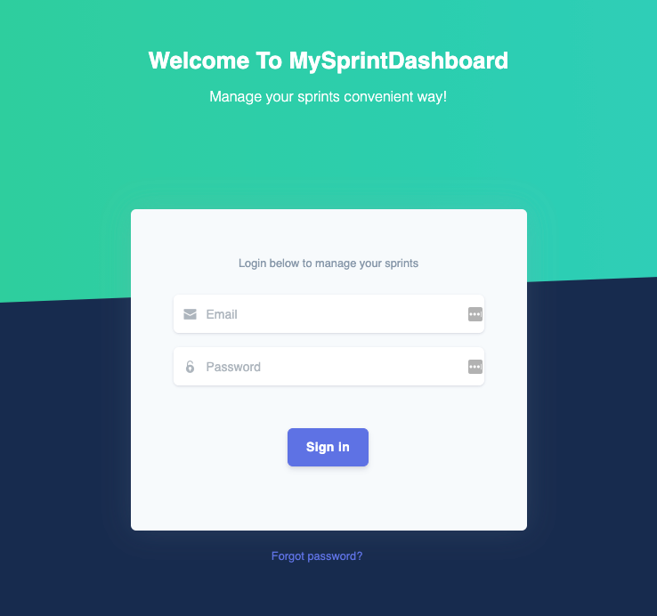
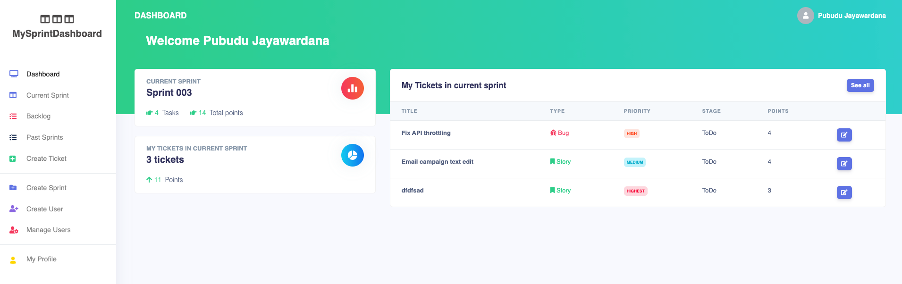
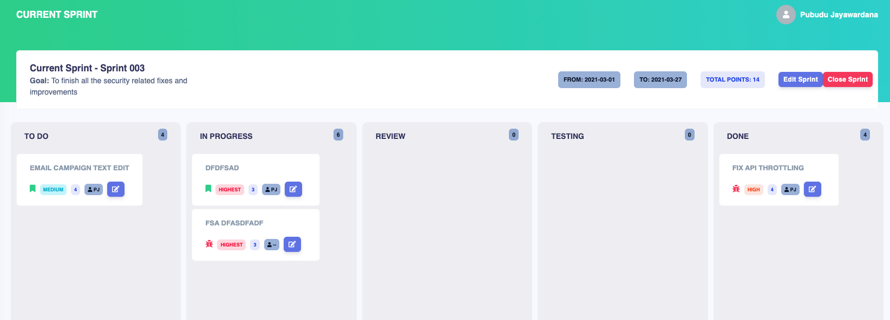
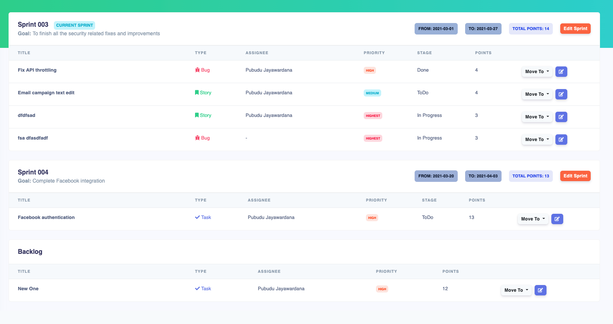

# [MySprintDashboard](https://dashboard.pubudu.dev)

This repository is contains the project I build using AWS Amplify, Vue, GraphQL. You may find the detail explanation in my blog post [here](https://pubudu.hashnode.dev/sprint-dashboard-with-aws-amplify)

**Screenshots**

Login:

Dashboard:

Current Sprint:

Backlog:

## Demo
URL: https://dashboard.pubudu.dev
You may first login with below admin credentials and create an account providing your email.

    pubudusj [at] gmail.com
    admin123#$
